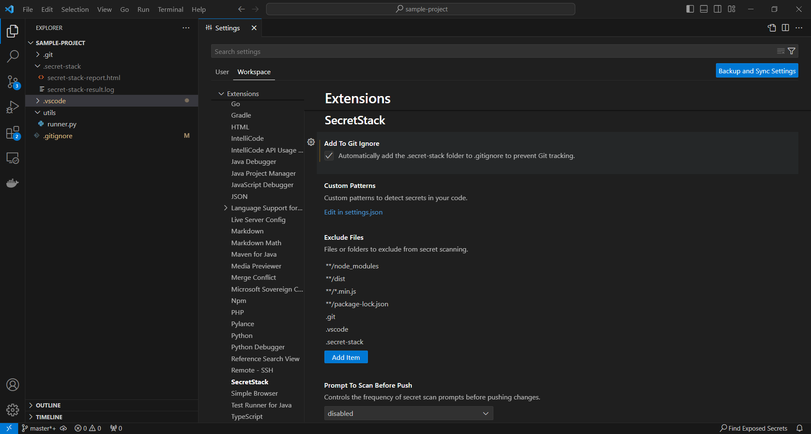
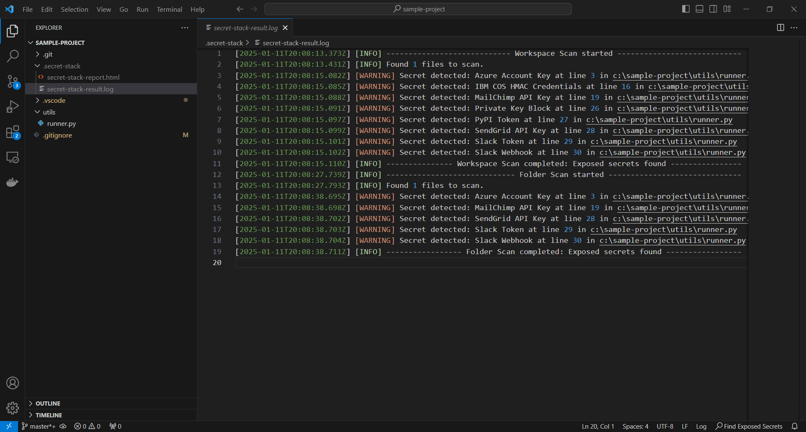
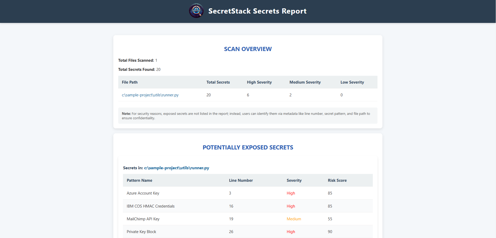
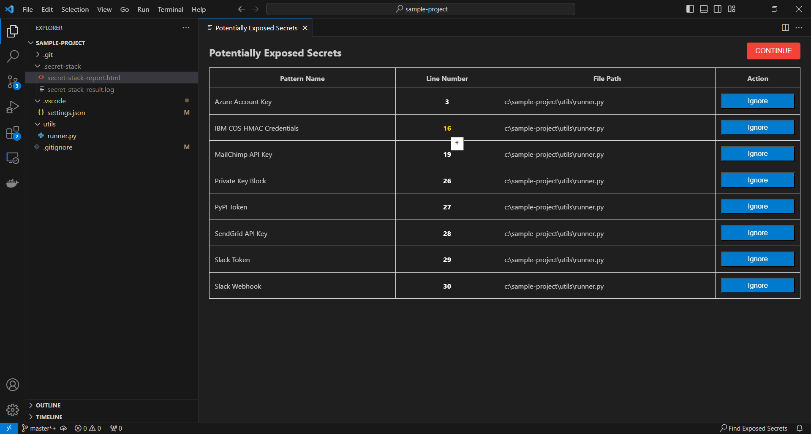

# SecretStack for VSCode
If SecretStack helps you, consider giving us a ⭐ on **[GitHub](https://github.com/ArpitStack/secret-stack)**! Your support encourages future development and helps others discover this tool!


**SecretStack** is a Visual Studio Code extension that easily scans your project for sensitive information such as API keys, passwords, tokens, and more. You can manually trigger scans to help secure your codebase by identifying potential secrets quickly.


## 🚀 Features

1. 🔍 **Manual Scan Control**
   - Scan your entire workspace or specific folders for sensitive information with a single click on the **Find Exposed Secrets** button in the VSCode status bar. 
   - Scans only run when triggered, giving you control over scan timing without disrupting your workflow.

2. 🧩 **Custom Pattern Detection**  
   - Define custom regex patterns to detect secrets like **GitHub tokens**, **AWS keys**, and more, tailored to your specific needs.

3. 📄 **Comprehensive Logs**  
   - All scans are logged in the `.secret-stack` folder, including:
     
     - **.secret-stack-result.log**: Detailed scan logs with start time, files scanned, and detected secrets in workspace.
     - **.secret-stack-report.html**: A visually rich HTML report summarizing detected secrets, severity, and file locations.

   - By default, `.secret-stack` is added to `.gitignore` to prevent accidental commits)

4. ⏱️ **Real-Time Feedback**  
   - Get time-stamped updates during the scan, including the number of files scanned and any detected secrets.

5. 🔐 **Pre-Commit Scan Reminder**  
   - When committing changes, SecretStack reminds you to run a quick scan to check for any exposed secrets before pushing.

###

## 🛠️ Installation & Setup

### 1. Install the Extension
   - Open **VSCode**, go to the **Extensions Marketplace**, and search for **SecretStack**.
   - Click **Install** to add the extension.
### 2. Manual Installation from `.vsix` File (Alternative)
   - Visit the [SecretStack GitHub repository](https://github.com/ArpitStack/secret-stack) and download the latest `.vsix` package from the **Releases** section.
   - In **VSCode**, open the **Command Palette** (`Ctrl+Shift+P`), search for **"Install from VSIX"**, and select the downloaded file.
### 3. Run a Scan
   - After installation, click the **Find Exposed Secrets** button in the **status bar** to start scanning your workspace for secrets.
   - You will be prompted to choose where to scan:

      - **Entire Workspace**: Scans all files within your workspace.
      - **Specific Folder**: Allows you to select a specific folder within the workspace to scan.
   - Select the desired option to start the scan.
### 4. Review and Fix Detected Secrets
   - The **webview** will display all detected secrets, including the **file path** and **line number**.
   - Click the line number to navigate directly to the location of the secret and fix it.
   - If a **false positive** is detected, click **Ignore** in the webview to exclude it from the report and logs.
   - If everything looks good, click **Continue** to finalize the scan.
### 5. View Scan Results
   - After completing the scan, go to the `.secret-stack` folder:
     
     - **.secret-stack-result.log**: Detailed log of the scan.
     - **.secret-stack-report.html**: A summary report of detected secrets and their severity.

###

## 🔧 Configuration

You can customize how SecretStack works through your VSCode settings.

### Git Ignore Configuration

By default, SecretStack will ask if you want to add the `.secret-stack` folder to `.gitignore`. This is recommended to avoid committing sensitive log or report files by prompting user to run a scan before Git push. You can disable this behavior through the configuration.

```
"secret-stack.addToGitIgnore": false
```

### Custom Patterns
To detect custom secrets, you can configure your own regex patterns. Add these patterns in your workspace settings (`settings.json`):

```json
"secret-stack.customPatterns": [
    {
        "name": "Custom API Key",
        "regex": "custom_api_[a-zA-Z0-9]{32}",
        "severity": "High"
    },
    {
        "name": "Internal Token",
        "regex": "int-token-[0-9]{16}",
        "severity": "Medium"
    }
]
```

- **name**: The name you want to give to the pattern (e.g., "Custom API Key").
- **regex**: The regex pattern used to match the secret you want to detect.
- **severity**: The severity level for this secret (e.g., `Low`, `Medium`, `High`).

You can add as many custom patterns as needed to suit your project’s requirements.


### Exclude Files from Scanning

If you want to exclude certain files or folders from being scanned, you can specify them in your workspace settings.

```
"secret-stack.excludeFiles": [
    "**/node_modules", 
    "**/dist", 
    "**/*.min.js", 
    "**/package-lock.json", 
    ".git", 
    ".vscode", 
    ".secret-stack"
]
```

This helps prevent unnecessary scans of files that aren’t relevant to secret detection, such as build files or dependencies.



### Secret Scan Prompt Configuration

By default, SecretStack will prompt you to run a secret scan before pushing committed changes. You can configure the frequency of this prompt or disable it entirely. The available options are:

- **always**: Prompt every time before a push.
- **30days**: Prompt once every 30 days.
- **disabled**: Disable the prompt entirely.

You can configure this behavior in your settings:

```
"secret-stack.promptToScanBeforePush": "always"
```


###

## 📝 **Log & Report Generation Example**

When you run a scan, **SecretStack** generates detailed logs and a comprehensive report to track the scanning process and provide insight into the results.

### **Logs:**  
Logs are saved in the `.secret-stack-result.log` file located in the `.secret-stack` folder. This log file contains step-by-step details about the scan, including timestamps, files scanned, and any secrets detected. Below is an example of a log entry:

```
[2024-11-24T11:35:25.701Z] [INFO] ---------------------------- Workspace Scan started ----------------------------
[2024-11-24T11:35:25.767Z] [INFO] Found 1 files to scan.
[2024-11-24T11:35:25.770Z] [WARNING] Secret detected: GitHub Token at line 7 in /home/user/sample-project/test.js
[2024-11-24T11:35:25.772Z] [INFO] --------------- Workspace Scan completed: Exposed secrets found ---------------
```

- **Scan started**: Timestamp when the scan was initiated.
- **Found X files to scan**: Number of files discovered and scanned in the workspace.
- **Secret detected**: The detected secret (e.g., GitHub Token) along with the specific file and line number where it was found.
- **Scan completed**: Indicates the completion of the scan, whether secrets were found or not.



### **Report:**  
In addition to the log, SecretStack generates a **.secret-stack-report.html** file. This HTML report provides a visually rich summary of the scan, displaying the detected secrets, their severity, risk levels, and the specific locations (file and line number) where they were found.

- **Visual Summary**: The report highlights detected secrets in a user-friendly format with color-coded risk levels.
- **Detailed Breakdown**: Shows file paths, line numbers, and severity of each detected secret.



###

## ⚠️ Handling False Positives

If **SecretStack** detects secrets that are false positives (e.g., test API keys, mock data, or other non-sensitive information), you can easily dismiss them. Simply click the **"IGNORE"** button in the webview to mark them as false positives. This action ensures that they are excluded from the scan results, logs, and final reports.

By ignoring false positives, you can maintain clean and accurate logs, ensuring that only actual security threats are flagged. This feature helps streamline the scan process and improves the accuracy of your reports.



###

## 📄 License

This project is licensed under the Apache License, Version 2.0 - see the [LICENSE](LICENSE) file for details.

###

## 🤝 Contributing

We welcome contributions! If you would like to contribute to **SecretStack**, please follow these steps:

1. **Fork the Repository**: Click the "Fork" button at the top-right of the repository page on GitHub.

2. **Clone Your Fork**:  
   Clone your forked repository to your local machine:
   ```bash
   git clone https://github.com/<YourUsername>/secret-stack.git
   ```

3. **Create a New Branch**:  
   Always create a new branch for your changes to keep your work organized and separate from the main branch:
   ```bash
   git checkout -b your-branch-name
   ```

4. **Make Your Changes**:
   Implement your changes, whether it's fixing a bug, adding a feature, or improving the documentation.

5. **Commit Your Changes**:
   Once you’ve made your changes, stage and commit them with a descriptive message:
   ```bash
   git add .
   git commit -m "Brief description of the changes"
   ```

6. **Push Your Changes**:
   Push your branch to your forked repository on GitHub:
   ```bash
   git push origin your-branch-name
   ```

7. **Submit a Pull Request (PR)**:
   1. Go to the original SecretStack repository on GitHub.
   2. Click on New Pull Request.
   3. Select your branch as the source and the main branch of the original repository as the destination.
   4. Provide a clear description of your changes in the PR description.
   5. Click Create Pull Request.

8. **Address Feedback**:
   A maintainer will review your pull request. Be prepared to:
   - Make any requested changes.
   - Engage in discussion about your PR if needed.
   - Push additional commits to the same branch to update the PR.
   Once the maintainer approves your changes, your contribution will be merged!

9. **Sync Your Fork** (Optional but Recommended):
   To keep your fork updated with the latest changes from the main repository, add the original repository as a remote:
   ```bash
   git remote add upstream https://github.com/ArpitStack/secret-stack.git
   ```
   Fetch and merge the latest changes:
   ```bash
   git fetch upstream
   git merge upstream/main
   ```

For more details on contributing, refer to the [CONTRIBUTING.md](CONTRIBUTING.md) file.

Thank you for your contribution!

## 🔗 Contact
For any questions or issues, please open an issue in the GitHub repository.
